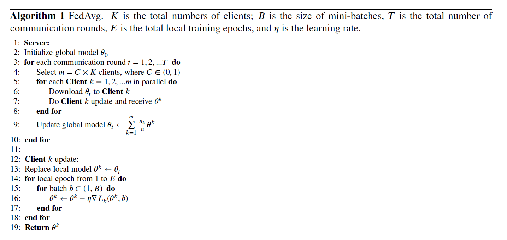

# Horizontal-Federated-Learning
This is a simple implementation of Horizontally Federated Linear Regression applied to a synthetic dataset.

[Source: Federated learning on non-IID data: A survey](https://www.sciencedirect.com/science/article/abs/pii/S0925231221013254)

NB: Citing this GitHub repository would be highly appreciated if used for any research purpose.

